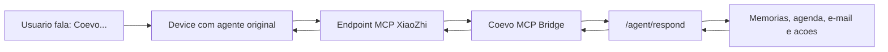

# Coevo como service MCP do agente original XiaoZhi

Este caminho e paralelo ao firmware proprietario do Coevo. Ele nao altera o
firmware que estamos construindo para o ESP32. A ideia e permitir que o agente
original do dispositivo chame o Coevo como uma ferramenta MCP.

## Arquitetura



O agente original continua cuidando de wake word, captura de audio e fala. O
Coevo entra como cerebro/memoria/ferramenta por meio da ferramenta:

```text
coevo.ask
```

## Variaveis

Configure no ambiente do servico que vai rodar o bridge:

```env
XIAOZHI_MCP_ENDPOINT=wss://api.xiaozhi.me/mcp/?token=seu-token
API_URL=https://um-meeting-ai-production.up.railway.app
AGENT_API_KEY=mesmo-agent-api-key-da-api-principal
XIAOZHI_MCP_ORGANIZATION_ID=default
XIAOZHI_MCP_AGENT_ID=coevo
XIAOZHI_MCP_USER_ID=xiaozhi-device
XIAOZHI_MCP_USER_NAME=Smart speaker XiaoZhi
XIAOZHI_MCP_USER_EMAIL=
XIAOZHI_MCP_SESSION_PREFIX=xiaozhi
XIAOZHI_MCP_RECONNECT_SECONDS=8
```

Nunca commite a URL real com token. O endpoint MCP deve ficar apenas nas
variaveis do Railway ou no ambiente local de teste.

O bridge e apenas um adaptador. Ele nao acessa banco, OpenAI ou Google Agenda
diretamente. Ele chama a API principal usando `API_URL` e `AGENT_API_KEY`.
Por isso, as variaveis completas continuam concentradas na API principal.

## Como rodar

No Railway, crie um servico separado usando o mesmo repositorio e a mesma pasta
`apps/api`, mas com o comando:

```bash
python -m app.xiaozhi_mcp_bridge
```

O `Procfile` tambem expoe o processo:

```text
xiaozhi-mcp: python -m app.xiaozhi_mcp_bridge
```

Variaveis minimas desse servico:

- `XIAOZHI_MCP_ENDPOINT`
- `API_URL`
- `AGENT_API_KEY`

As demais variaveis do Coevo ficam na API principal.

## O que o bridge responde

O bridge implementa as chamadas MCP principais:

- `initialize`
- `tools/list`
- `tools/call`

A ferramenta registrada e:

```json
{
  "name": "coevo.ask",
  "description": "Converse com o Coevo usando memoria e configuracoes do sistema.",
  "inputSchema": {
    "type": "object",
    "required": ["message"],
    "properties": {
      "message": { "type": "string" },
      "user_name": { "type": "string" },
      "user_id": { "type": "string" },
      "organization_id": { "type": "string" },
      "context": { "type": "string" }
    }
  }
}
```

O bridge tambem registra uma ferramenta especifica para Google Agenda:

```json
{
  "name": "coevo.schedule_meeting",
  "description": "Cria um evento no Google Agenda conectado ao Coevo.",
  "inputSchema": {
    "type": "object",
    "required": ["title", "start_time"],
    "properties": {
      "title": { "type": "string" },
      "start_time": {
        "type": "string",
        "description": "ISO 8601. Exemplo: 2026-05-30T14:00:00-03:00"
      },
      "duration_minutes": { "type": "integer" },
      "attendees": {
        "type": "array",
        "items": { "type": "string" }
      },
      "description": { "type": "string" },
      "user_name": { "type": "string" }
    }
  }
}
```

## Prompt recomendado no agente original

No painel do agente original, use uma instrucao parecida:

```text
Seu nome de chamada e Coevo.

Quando o usuario pedir algo sobre reunioes, memoria, clientes, decisoes,
pendencias, follow-up, e-mail, tarefas, propostas ou informacoes da empresa,
chame a ferramenta coevo.ask.

Passe para coevo.ask a fala completa do usuario no campo message. Se houver
contexto adicional que voce percebeu, envie no campo context.

Quando coevo.ask retornar uma resposta, fale essa resposta ao usuario sem
inventar detalhes adicionais.

Quando o usuario pedir para agendar, marcar ou criar uma reuniao futura, colete
título, data, horario, duracao e convidados. Antes de criar, confirme por voz
com o usuario. Depois da confirmacao, chame coevo.schedule_meeting. Use
start_time em ISO 8601, por exemplo 2026-05-30T14:00:00-03:00.
```

## Observacoes

- Este modo nao substitui o firmware proprietario do Coevo.
- A voz e o wake word continuam sob controle do agente original.
- O bridge chama a API principal em `/agent/respond`, portanto acessa memoria,
  personalidade e configuracoes ja existentes sem duplicar o cerebro do Coevo.
- Acoes sensiveis continuam dependendo das politicas do backend Coevo.
